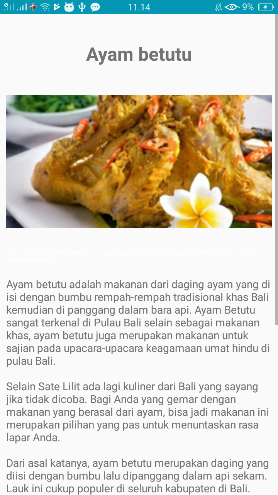

## Nama Kelompok :
Anggi Illahi Sulton (1541180003)
Novia Puspitasari (1541180183)

# DESKRIPSI - APLIKASI DESA WISATA

Aplikasi Desa Wisata merupakan sebuah aplikasi yang dapat memberikan informasi mengenai desa wisata yang terdapat di Bali. Selain untuk informasi desa wisata,  plikasi juga menyediakan informasi mengenai makanan khas yang terdapat di daerah tersebut. 

Fitur lainnya yang dapat ditermui di aplikasi ini ialah kritik dan saran, permainan dan lokasi yaitu dimana lokasi menyediakan informasi tempat mengenai restaurant, penginapan, rumah sakit dan sekolah yang terdekat.

Aplikasi berbasis android ini dibuat dengan berbagai macam fitur yang disediakan android, yaitu adalah Firebase Cloud Mesaging, Fragment, Places, media playback, dan widget. 

pada fitur permainan disediakan 2 buah permainan yaitu Garden Game dan Game Tebak Lagu. Garden Game merupakan game yang dibuat seperti 
game Tamagochi, yaitu merawat tanaman, yang mana nnti tanaman itu bisa tumbuh. Garden Game dibuat dengan menggunakan Widget, sedangkan Game Tebak Lagu dibuat dengan  menggunakan Media Playback. 

## Berikut Hasil dari Aplikasi :
### 1.SplashScreen

### 2.Beranda

### 3.Desa Wisata

### 4.Detail Desa Wisata

### 5.Makanan Khas

### 6.Detail Makanan Khas

### 7.Kritik dan Saran

### 8.List Kritik Saran

### 9.Lokasi (List)

### 10.Lokasi (Detail)

### 11.Garden Game

### 12.Game Tebak Lagu

